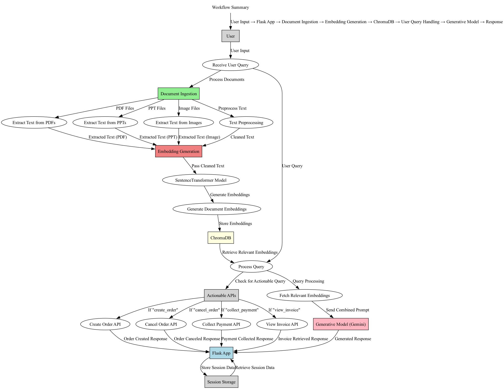

# RX-Assistant

RX-Assistant is a chatbot application that can process and respond to user queries based on the documents stored in your directory. It utilizes ChromaDB for document storage and retrieval, Google Generative AI for generating responses, and Hugging Face for embeddings.

## Hackathon Submission

This project is a submission for [HackRX](https://hackrx.in/) for the problem statement **Context Aware Chatbot**.

## Endpoint URL

```bash
http://localhost:3000/chat
```

## Data Flow


## Snapshots


## Getting Started

### Prerequisites

Make sure you have the following installed:

- Python 3.x
- Pip (Python package installer)

### Installation

1. Clone the repository:

   ```bash
   git clone https://github.com/msnabiel/RX-Assistant.git
   cd RX-Assistant
   ```

2. Install the required packages:

   ```bash
   pip install -r requirements.txt
   ```

### Setting Up Documents

1. Place your documents (PDFs, PPTs, images, and text files) in the `documents` folder.

### Loading Documents

Run the load_documents.py file or run the following command to load the documents into ChromaDB:

```bash
python load_documents.py
```

### Running the Application

After loading the documents, start the Flask application:

```bash
python index.py
```

### API Endpoint

The chat functionality can be accessed via the `/chat` endpoint. You can send a POST request to this endpoint with a JSON payload containing the user's query.

### Example cURL Command

You can test the API using cURL:

```bash
curl --location "localhost:3000/chat" --header "Content-Type: application/json" --header "x-user-id: 1234" --header "x-session-id: J5S7P1ZQ" --data "{\"query\":\"What is said about the pandemic?\"}"
```

### Response

```json
{
 {"bot_message":"The pandemic has been punishing. \n"}
}
```
